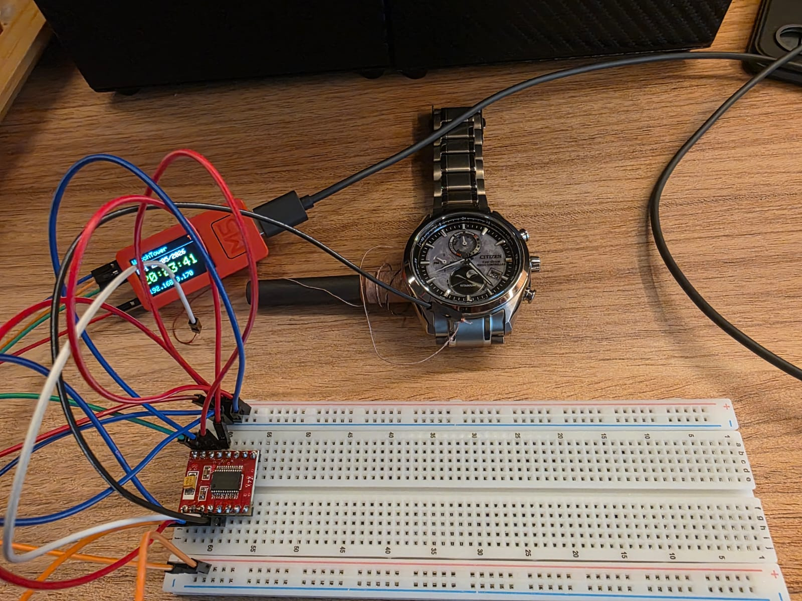
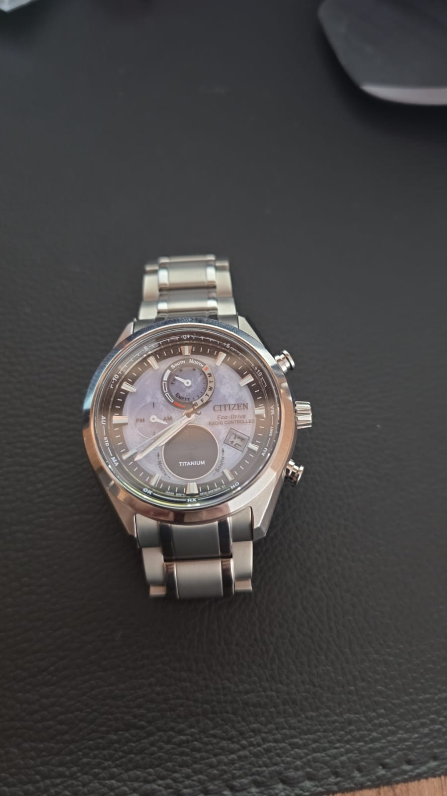
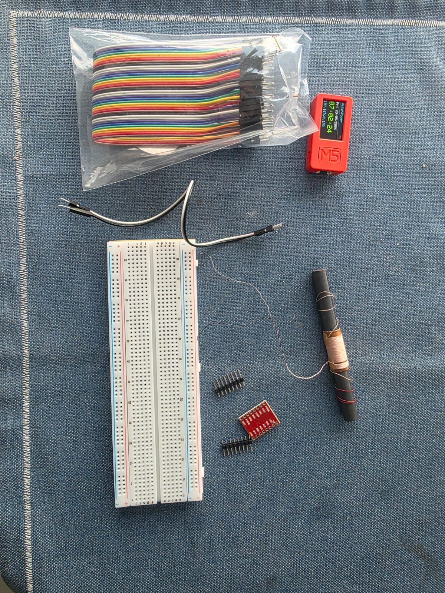
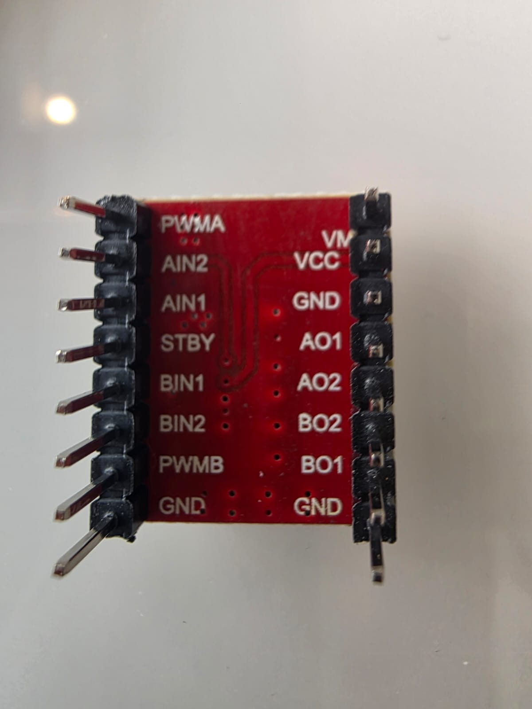

# WatchTower BR 📡⌚

> **Sincronize seu relógio radiocontrolado multibanda em casa, no Brasil.**
> Pequeno transmissor WWVB caseiro de 60 kHz que faz seu Citizen, Casio Waveceptor, Junghans ou outro multibanda WWVB pegar a hora certa **sem precisar do sinal de Fort Collins (EUA)**.

## ✅ Status: TESTADO E FUNCIONANDO

Confirmado funcionando com **Citizen Eco-Drive H874 (Titanium Radio Controlled)** em maio/2026:

- ⏱️ Recepção OK no relógio
- 🕐 Hora sincronizada com NTP
- 📅 Data atualizada
- 🇧🇷 Operando em São Paulo, Brasil (fora do alcance natural do WWVB)



*Montagem completa em operação: M5StickC Plus gerando o sinal WWVB, TB6612 amplificando, antena de ferrite acoplada ao relógio (lado das 9h). Recepção OK em 2 a 30 minutos.*

---

## Pra quem é isso?

Se você tem um **relógio radiocontrolado multibanda** (compatível com WWVB de 60 kHz) e mora **longe de Fort Collins, Colorado** (basicamente o mundo todo fora da América do Norte), seu relógio **nunca recebe sinal**. As linhas de tempo dele dependem de você ajustar manualmente, perdendo a graça do "atomic timekeeping".

Marcas/modelos comuns que suportam WWVB:
- **Citizen Eco-Drive Radio Controlled** (multibanda 5 ou 6)
- **Casio Waveceptor / G-Shock Multiband 6**
- **Junghans Mega Solar**
- **Seiko Astron** (radiocontrolados, não os GPS)
- Vários outros relógios "atomic" / "radio controlled"

Este projeto cria um **pequeno transmissor caseiro de 60 kHz no seu próprio quarto**, que o relógio capta como se fosse o sinal real do WWVB.



*O Citizen Eco-Drive H874 (Titanium Radio Controlled) — o protagonista deste projeto. Multibanda capaz de receber WWVB (EUA), DCF77 (Alemanha), JJY (Japão) e BPC (China), mas sem cobertura nativa no Brasil.*

---

## Como funciona, em 3 frases

1. Um **M5StickC Plus** (mini computador ESP32) pega a hora certa pela **internet (NTP)**.
2. Ele **gera o sinal WWVB** modulado em 60 kHz e empurra esse sinal por um **amplificador (TB6612)** numa **bobina de ferrite**.
3. A bobina emite o campo magnético pertinho, **o relógio capta com a antena interna dele** e sincroniza hora e data — pensando que recebeu o sinal real dos EUA.

> É **acoplamento magnético de campo próximo** — não é uma antena de rádio convencional. O alcance é de **poucos cm**, então o relógio fica encostado na bobina durante a recepção (2 a 30 min).

---

## ⚠️ Lições aprendidas (LEIA ANTES de começar!)

Foram **dias de debug** pra chegar no projeto funcionando. Se você for replicar, esses aprendizados economizam horas:

### 1. 🔧 Multímetro digital é **obrigatório**, não opcional

> Eu passei **2 dias debugando às cegas** sem multímetro, trocando peças, suspeitando do firmware, refazendo soldas. O problema real era **um plugue solto** no 5V — coisa que o multímetro resolve em 30 segundos.

Custa **R$30**. Compre **antes** de começar o build. Sem ele você vai sofrer.

### 2. 🔌 "Plugue firme" frequentemente não está firme

Protoboard com fios finos enrolados em pino macho parecem firmes, mas o contato falha. **Meça com o multímetro** os 3V3, 5V, GND e VM **antes** de testar o sinal. Se algum desses estiver fora, **nada** funciona.

### 3. 📞 Bobina de ferrite tem fios super finos e frágeis

Cada vez que você **solda, dessolda ou raspa** o fio da bobina, você está perto de quebrá-lo. **Limite o manuseio**. Quando soldar, faça **uma vez só** e bem feito. Fio esmaltado: **raspe o esmalte** com lixa ou estilete antes de soldar (senão a solda gruda mas não conduz).

### 4. 🔋 Relógio precisa estar **100% carregado**

Eco-Drive com carga baixa **não roda recepção**. Antes do teste, deixe o relógio na **luz forte da janela** por algumas horas. Se o ponteiro dos segundos pula de 2 em 2 segundos, está com pouca carga.

### 5. 🌐 Fuso horário determina **qual estação o relógio escuta**

O Citizen H874 (e outros multibanda) escuta uma estação diferente dependendo do fuso configurado:

- **UTC-3 (Brasília)** → ouve **WWVB (EUA, 60 kHz)** ✅ É o que a gente transmite!
- UTC+0 (padrão de fábrica após reset) → ouve **DCF77 (Alemanha, 77,5 kHz)** ❌
- UTC+8 → ouve BPC (China)
- UTC+9 → ouve JJY (Japão)

**Depois de fazer reset total no relógio, o fuso volta pra UTC+0**, e ele passa a procurar a estação alemã — não a nossa! Sempre re-configure o fuso pra **UTC-3 (posição 57 do ponteiro de segundos)** depois de qualquer reset.

### 6. 📍 Posição de referência dos ponteiros afeta o display

O H874 tem "posição de referência" dos ponteiros e do calendário. Se ela está desalinhada, o relógio **recebe a hora e a data certas mas exibe errado**. Procedimento de correção no manual, página 9.

### 7. ⚡ Bare GPIO + ferrite às vezes funciona, mas é marginal

Você consegue obter recepção apenas com a bobina ligada direto no GPIO do M5Stick (3,3V), mas é instável. O **amplificador TB6612 (5V, alta corrente)** é o que faz funcionar **confiável**.

### 8. 🔇 Chip TB6612 frio = chip não está chaveando

Se o TB6612 fica frio durante operação, ele não está empurrando corrente. Provavelmente:
- **STBY não está em 3V3** → chip em standby (foi nosso problema!)
- VM não tem 5V
- Algum jumper de controle solto

Meça com o multímetro: STBY, AIN1, VCC, VM devem todos estar nas tensões certas.

---

## 🛒 Hardware necessário



*Todos os componentes do projeto antes da montagem. No alto à direita, o M5StickC Plus já rodando o firmware (tela mostrando data, hora e IP). À direita, a antena de ferrite com a bobina enrolada — o "transmissor" propriamente dito.*

Lista do que você precisa comprar (preços de maio/2026 no Mercado Livre, Brasil):

| Item | Valor aproximado | Pra que serve |
|---|---|---|
| **M5StickC Plus 1.1** (ESP32-PICO + LCD) | R$ 100 | O "cérebro" — gera o sinal |
| **TB6612FNG breakout** | R$ 25 | Amplificador (essencial!) |
| **Antena de ferrite com bobina** (100mm, para rádio AM) | R$ 33 | A "antena" transmissora |
| **Protoboard 830 furos** (MB-102) | R$ 19 | Pra montar o circuito |
| **Jumpers macho-macho** (40 unid) | R$ 19 | Pra conectar tudo |
| **Placa ilhada 3x7cm** (5 unid) | R$ 28 | Pra montagem definitiva (fase final) |
| **Ferro de solda básico** | R$ 30-50 | Pra soldar pinos no TB6612 |
| ⚠️ **Multímetro digital** | R$ 30 | **NÃO PULE** — leia lição #1 acima |
| Pilha 9V + clip *(opcional)* | R$ 15 | Pra mais potência (substituir 5V) |
| **TOTAL** | **~R$ 300** | |

> 🛑 Sobre o multímetro: parece "supérfluo" pra quem nunca debugou eletrônica, mas é a **diferença entre 2 horas e 2 dias** de trabalho. Não tente sem.

---

## 🔨 Build — caminho que funcionou

### Fase 1: Firmware no M5Stick (15 min)

```bash
# Instalar PlatformIO (uma vez)
python3 -c "$(curl -fsSL https://raw.githubusercontent.com/platformio/platformio-core-installer/master/get-platformio.py)"

# Clonar
git clone https://github.com/fbmarques-agios/WatchTower.git
cd WatchTower

# Compilar e gravar (M5Stick conectado por USB)
sudo chmod 666 /dev/ttyUSB0  # libera porta serial
~/.platformio/penv/bin/pio run -e m5stickc_plus -t upload
```

No primeiro boot, o M5Stick cria a rede WiFi "WatchTower" — conecte pelo celular e configure sua rede de casa. Depois disso ele sincroniza com NTP e fica pronto.

### Fase 2: Soldar o TB6612

O módulo vem com pinos soltos. Solde-os usando a protoboard como suporte (ela alinha os pinos enquanto você solda):
1. Espete as duas barras de pinos na protoboard (atravessando o vale do meio).
2. Encaixe o TB6612 por cima.
3. Solde cada pino do topo. Não precisa muita solda — só o suficiente pra cobrir.

### Fase 3: Montar o circuito na protoboard

Use a protoboard pra testar sem comprometer. Esta tabela é o esquema final:



*Pinout do breakout TB6612FNG visto de cima — use como referência ao montar. A serigrafia em cima da placa identifica cada pino. Vamos usar apenas o canal A (PWMA / AIN1 / AIN2 / AO1 / AO2).*


**Fios do M5Stick → trilhos da protoboard:**

| M5Stick | Protoboard | Pra que |
|---|---|---|
| `3V3` | Trilho `+` esquerdo (será o 3V3) | Alimenta a lógica |
| `5V` | Trilho `+` direito (será o 5V) | Alimenta a ponte-H |
| `GND` | Trilho `-` esquerdo (será o GND) | Terra |
| `G26` | Pino **PWMA** do TB6612 | Sinal de 60 kHz |

**Jumpers do TB6612 (entre pinos da placa):**

| Pino TB6612 | Liga em | Pra que |
|---|---|---|
| **VM** | Trilho 5V | Alimentação da ponte |
| **VCC** | Trilho 3V3 | Alimentação da lógica |
| **GND** (qualquer um) | Trilho GND | Terra |
| **STBY** | Trilho 3V3 | **Acorda o chip** (sem isso ele dorme!) |
| **AIN1** | Trilho 3V3 | Direção "forward" |
| **AIN2** | Trilho GND | Direção "forward" |

**Antena de ferrite:**
- Os dois fios da bobina → pinos **AO1** e **AO2** do TB6612.
- ⚠️ **Use jumpers (ponta fêmea segura o fio fino)** — não enfie o fio fino direto no furo da protoboard, não faz contato.

### Fase 4: ⚠️ Verificação com multímetro (ANTES de testar)

Antes de ligar o relógio no circuito, mede com o multímetro (configuração: `V=` escala 20, ponta preta no GND):

| Onde tocar a ponta vermelha | Deve dar |
|---|---|
| Trilho 3V3 | ~3,3 V |
| Trilho 5V | ~5,0 V |
| Pino VCC do TB6612 | ~3,3 V |
| Pino VM do TB6612 | ~5,0 V |
| **Pino STBY do TB6612** | **~3,3 V** ⚡ crítico! |
| Pino AIN1 do TB6612 | ~3,3 V |
| Pino AIN2 do TB6612 | ~0 V |

**Se algum estiver muito diferente, AJUSTE antes de prosseguir.** Foi nosso bloqueio principal: STBY estava em 0,6 V (chip dormindo) por causa de um plugue solto. Sem o multímetro, levaríamos dias pra achar.

### Fase 5: Configurar o relógio (H874)

1. **Carregue o relógio**: deixe na luz forte por algumas horas. Tem que estar com bateria cheia.
2. **Fuso horário em UTC-3**:
   - Coroa na posição 1.
   - Gire a coroa até o ponteiro dos segundos apontar a **posição 57** (= UTC-3 = WWVB).
   - Empurre a coroa pra posição 0.
3. **Horário de verão em STD MA** (manual / standard time): nosso firmware transmite "sem DST".

### Fase 6: Recepção!

1. Posicione o relógio **em cima da bobina de ferrite**, com o **lado das 9 horas** alinhado com o bastão.
2. Coroa do relógio na posição 0.
3. **Segure o botão A** (inferior direito) por 2-3 segundos.
4. Confirme que o **ponteiro dos segundos pulou para "RX"** (modo de recepção).
5. **Não mexa.** A recepção leva de 2 a 30 minutos.
6. Quando terminar, **toque rápido no botão A** → o ponteiro mostra **OK** ou **NO**.

**Se der OK** + a hora e data corretas → 🎉 vitória!
**Se der OK** mas a data ficou errada → corrigir **posição de referência** (manual H874, página 9).
**Se der NO** → ler a seção de lições aprendidas e debugar com o multímetro.

---

## 🧠 Como funciona por dentro

```
NTP (pool.ntp.org)
   ↓
M5Stick mantém relógio interno (UTC)
   ↓
A cada segundo, calcula qual bit transmitir do quadro WWVB
   ↓
ledcWrite(GPIO26, 50% duty quando bit=1, 0% quando bit=0)
   → 60 kHz modulado em amplitude com o quadro WWVB
   ↓
GPIO26 → PWMA do TB6612 (entrada de controle)
   ↓
TB6612 amplifica para ±5V e empurra a bobina
   ↓
Bobina gera campo magnético modulado de 60 kHz
   ↓
Antena de ferrite interna do relógio capta o campo
   ↓
Relógio decodifica hora, data, ano e ajusta os ponteiros
```

O quadro WWVB tem 60 bits (1 por segundo, repete a cada minuto):
- Bits 0, 9, 19, 29, 39, 49, 59: **marcadores** de sincronismo
- Bits 1-8: minutos (BCD)
- Bits 12-18: horas UTC (BCD)
- Bits 22-33: dia do ano (BCD)
- Bits 45-53: ano (2 dígitos, BCD)
- Bits 55-58: ano bissexto + horário de verão

A largura do pulso "low" no início de cada segundo determina o valor do bit:
- **200 ms low + 800 ms high** = bit 0
- **500 ms low + 500 ms high** = bit 1
- **800 ms low + 200 ms high** = bit marcador

---

## 🔥 O que este fork adiciona ao projeto original

Este é um fork do projeto [emmby/WatchTower](https://github.com/emmby/WatchTower) (originalmente para Adafruit QT Py ESP32 + DRV8833). Adições:

| Mudança | Por que |
|---|---|
| Ambiente PlatformIO `m5stickc_plus` | Suporte ao M5StickC Plus 1.1 (4 MB flash) |
| LCD via M5Unified | Mostra hora, data, IP, status na telinha do M5Stick |
| Pino da antena em **GPIO26** (era GPIO13) | GPIO13 é usado pelo LCD interno do M5Stick |
| Constante `ANTENNA_DRIVE_LEVEL` (0-3) | Controle por software da força de saída do GPIO |
| Timezone padrão `BRT3` | Brasília sem horário de verão (correto pra Brasil atual) |
| Documentação em PT-BR + receitas pro **Citizen H874** | Específico pra realidade brasileira |
| Git hooks (`pre-commit` build, `pre-push` build + testes) | Qualidade de código |
| Native tests via Unity | Validação do encoder WWVB sem hardware |

O env original do projeto (`adafruit_qtpy_esp32`) está preservado.

---

## 📊 Estado do projeto

- ✅ **Firmware** funcionando 100% — sinal WWVB validado bit a bit
- ✅ **Fork no GitHub** publicado e documentado
- ✅ **Circuito amplificador TB6612 na protoboard** validado e operacional
- ✅ **Recepção confirmada** com Citizen H874
- ⏳ **Próxima fase:** migração pra placa ilhada (montagem definitiva soldada)
- ⏳ **Fase final:** caixa "torre" 3D impressa sob medida pro M5Stick

---

## 🙏 Créditos

- **[emmby/WatchTower](https://github.com/emmby/WatchTower)** — projeto original. Toda a lógica de codificação WWVB, a arquitetura geral e a caixa 3D original são dele. **Este fork apenas adapta** para outro hardware (M5Stick) e adiciona instruções em PT-BR para realidade brasileira.
- **[@fbmarques-agios](https://github.com/fbmarques-agios)** — fork, adaptação para M5StickC Plus, documentação em português.
- **Comunidade brasileira de relógios** — o "público-alvo" que motivou este fork.

---

## ⚖️ Aspectos legais

A regulamentação da FCC (EUA) isenta transmissores de 60 kHz desde que o campo elétrico seja **inferior a 40 μV/m a 300 metros**. A potência envolvida neste projeto (bobina de poucos cm de alcance) está **ordens de grandeza abaixo** desse limite — o sinal mal sai da mesa onde está o circuito.

Para uso pessoal/doméstico no Brasil, esta potência fica muito abaixo de qualquer limiar regulatório de dispositivo de baixa potência. Não há transmissão de "broadcast" significativa.

---

## 📜 Licença

MIT — veja [LICENSE](LICENSE). Mesmos termos do projeto upstream.

---

## 🆘 Suporte e perguntas

- **Bug ou dúvida?** Abra uma issue no GitHub.
- **Travando no debug?** Releia as **lições aprendidas** acima — provavelmente tem a resposta. Especialmente: **compre o multímetro**.
- **Quer compartilhar foto do seu build funcionando?** Marcaria os relojoeiros num PR ou issue. Adoraria ver.

---

> **"E agora seu Citizen pega sinal em São Paulo."** 🇧🇷⌚📡
